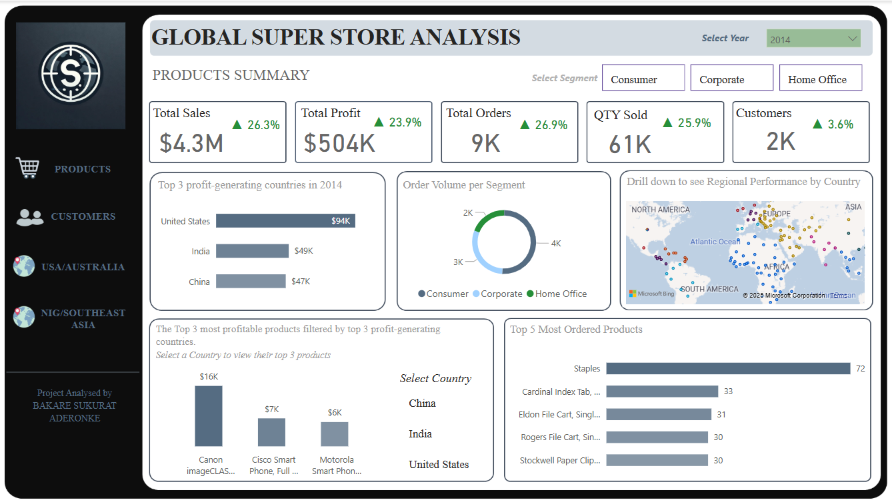
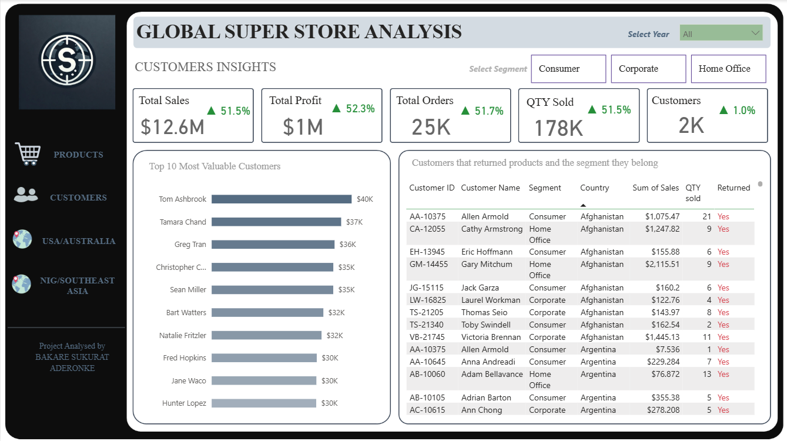
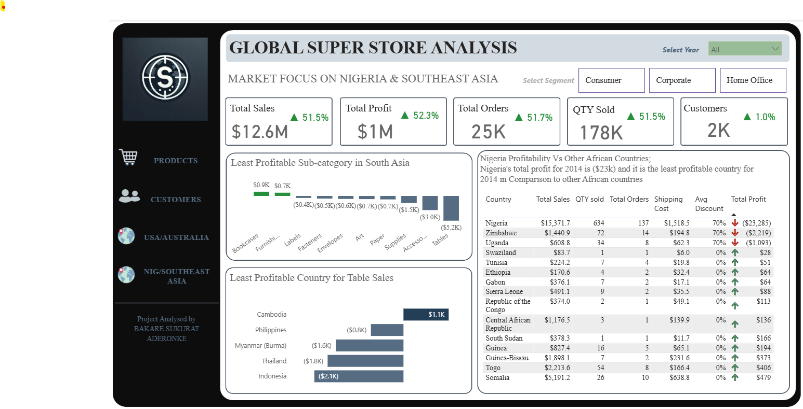
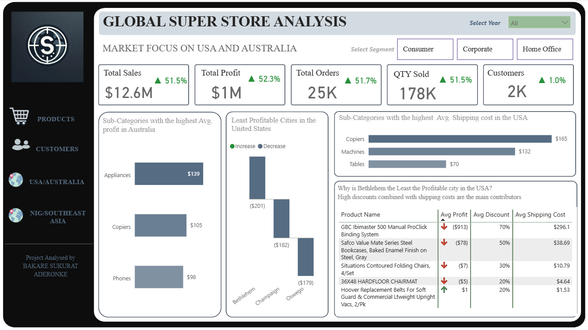

# 📊 Global Superstore Analysis Dashboard

## 🔍 Overview
This Power BI dashboard project offers an in-depth analysis of a global retail store's performance, focusing on **sales, profitability, and customer behavior** across key regions including the **USA, Australia, Nigeria, and Southeast Asia**. It highlights performance metrics by **year**, **customer segment**, **product category**, and **geography**.

---

## 💡 Key Features
- Interactive slicers for **Year** and **Segment** selection *(Consumer, Corporate, Home Office)*
- Dynamic KPIs with trend indicators *(Sales, Profit, Orders, Quantity, Customers)*
- Regional drilldowns using visual maps
- Product and country-level profitability analysis
- Identification of least/most profitable products, categories, and regions
- Customer return behavior and purchase volume tracking

---

## 📸 Dashboard Previews

### 🧾 Products Summary (Global Overview)

### 🧾 Products Summary (Global Overview)

### 🌍 Nigeria & Southeast Asia Focus

### 🇺🇸 USA and Australia Focus

---

## 📂 Dashboard Pages

### 1. Products Summary
- Global overview for 2014
- Top 3 profit-generating countries: **USA, India, China**
- Total Quantity Sold: **61K**
- Top 5 most ordered products
- Order volume breakdown by segment

### 2. Customers Summary
- Top 10 most valuable customers
- Table showing customers who returned products
- Details on customer segment, country, order quantity, and return value

### 3. Market Focus: Nigeria & Southeast Asia
- Total Sales: **$12.6M**
- Least profitable sub-category: **Tables (-$5.2K)**
- **Nigeria** recorded a loss of **$23K** – lowest in Africa
- Cambodia and Indonesia were least profitable for table sales

### 4. Market Focus: USA and Australia
- High sales and profits in both countries
- Top sub-categories in **Australia**: **Appliances, Copiers, Phones**
- Least profitable US city: **Bethlehem**
- Highest shipping cost categories in the US: **Copiers, Machines, Tables**

---

## ❓ Business Questions & Insights

### Question 1
**a)** Top 3 countries with highest total profit in 2014:
- USA: **$94K**
- India: **$49K**
- China: **$47K**

**b)** Top 3 most profitable products in the USA:
- Canon imageCLASS Printer – **$16K**
- Cisco Smart Phone, Full Duplex – **$7K**
- Motorola Smart Phone – **$6K**

*(Product-level details for other countries available on the dashboard.)*

---

### Question 2
**a)** Subcategories with highest average shipping cost in the US:
- Copiers – **$165**
- Machines – **$132**
- Tables – **$70**

---

### Question 3
**a)** Nigeria's total profit for 2014:
- **Loss of $23,285**

**b)** Root causes of Nigeria's loss:
- High average discount: **70%**
- High shipping cost: **$1,518.50**

---

### Question 4
**a)** Least profitable sub-category in Southeast Asia:
- **Tables (-$5.2K)**

**b)** Country with worst performance in that category:
- **Indonesia** – Table sales loss of **$2.1K**

📌 *Recommendation: Consider stopping table sales in Indonesia.*

---

### Question 5
**a)** Least profitable US city (with ≥10 orders):
- **Bethlehem** – Avg. Profit: **–$201**

**b)** Causes of poor performance:
- Discounts up to **70%**
- High shipping costs (up to **$296**)

---

### Question 6
**a)** Sub-category with highest average profit in Australia:
- **Appliances** – **$139**

*(Followed by Copiers: $105, Phones: $98)*

---

### Question 7
**a)** Most valuable customers and what they purchase:
- **Top customer: Ashbrook** – Purchases worth **$40K**
- Customer dashboard also highlights those who returned items and includes:
  - Quantity returned
  - Customer segment
  - Total sales amount
  - Country and Customer ID

---

## 📈 Business Insights Summary
- **Consumer segment** accounts for the highest order volume globally
- **USA** is the most profitable market; **India** and **China** follow
- **Nigeria** requires urgent review of discounting and logistics policies
- **Bethlehem** is underperforming due to combined effects of discounts and high shipping
- Monitoring **shipping costs** and **discount strategies** across regions is essential for long-term profitability

---

## 🧰 Tools & Technologies
- **Power BI** – Data modeling, report building, visual storytelling
- **Power Query** – Data cleaning and transformation
- **DAX** – KPI measures, profit, discount, and shipping logic
- **Excel** – Preliminary analysis and preprocessing

---

## 👩‍💻 Project Author
**Bakare Sukurat Aderonke**  
Data Analyst | Business Intelligence Enthusiast | Passionate about deriving insights from data  
🔗 [https://www.linkedin.com/in/aderonkebakare101](#) | 🔗 [https://github.com/Aderonke101](#)

---

> ✅ *Explore the interactive visuals and insights by checking out the full report in this repository.*

